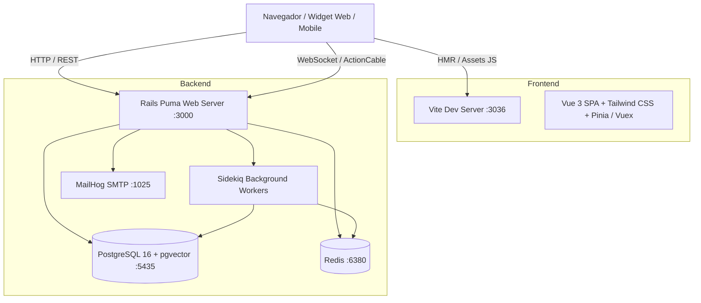
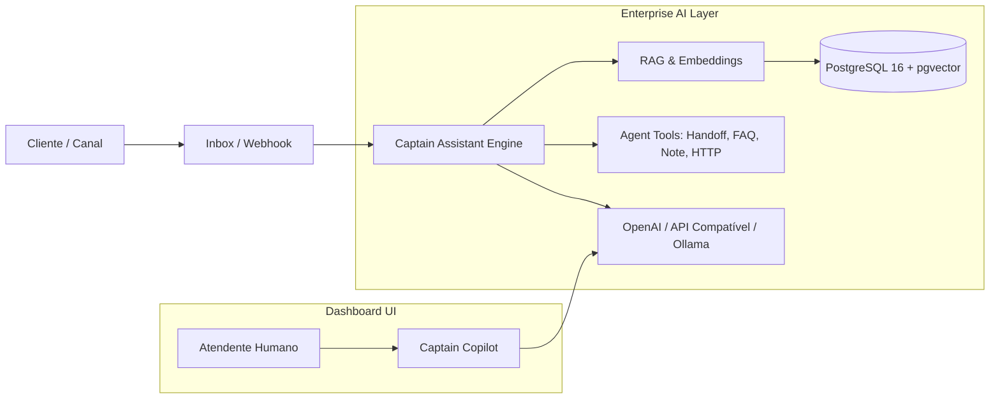

# Estudo Arquitetural e Operacional do Chatwoot

## 1. Visão Geral do Sistema

O **Chatwoot** é uma plataforma open-source de suporte e atendimento omnicanal (*Customer Engagement Platform*) voltada para gerenciar comunicações com clientes através de múltiplos canais (Live Chat, E-mail, WhatsApp, Telegram, Facebook, Instagram, SMS, etc.).

---

## 2. Acesso ao Ambiente Local e Credenciais

### 2.1. Credenciais de Acesso

| Papel | Nome | E-mail | Senha |
| :--- | :--- | :--- | :--- |
| **SuperAdmin (Principal)** | Dev Anagma | `dev@anagma.com.br` | `Linux@45` |
| **SuperAdmin (Seed Padrão)** | John | `john@acme.inc` | `Password1!` |

### 2.2. Endereços de Acesso

- **Aplicação Web (Dashboard / Painel de Login):** [http://localhost:3000/app/login](http://localhost:3000/app/login)
- **Painel de E-mails em Desenvolvimento (MailHog):** [http://localhost:8025](http://localhost:8025)
- **Vite Dev Server (Frontend Assets):** [http://localhost:3036/vite-dev/](http://localhost:3036/vite-dev/)

---

## 3. Topologia de Contêineres e Mapeamento de Portas

Para evitar conflitos com outros contêineres e bancos de dados em execução no host (ex.: instâncias locais de PostgreSQL na 5432 e 5434), as portas foram mapeadas da seguinte forma:

| Serviço | Contêiner | Porta Interna | Porta Mapeada (Host) | Finalidade |
| :--- | :--- | :--- | :--- | :--- |
| **Rails App** | `chatwoot-rails-1` | `3000` | `3000:3000` | Servidor Web Puma (Backend + API + ActionCable) |
| **Vite Server** | `chatwoot-vite-1` | `3036` | `3036:3036` | Servidor de desenvolvimento HMR / Vue 3 |
| **PostgreSQL** | `chatwoot-postgres-1` | `5432` | `5435:5432` | Banco de Dados PostgreSQL 16 com extensão `pgvector` |
| **Redis** | `chatwoot-redis-1` | `6379` | `6380:6379` | Cache, Pub/Sub do ActionCable e filas Sidekiq |
| **Sidekiq** | `chatwoot-sidekiq-1` | - | - | Processamento de jobs e workers assíncronos |
| **MailHog** | `chatwoot-mailhog-1` | `1025`, `8025` | `1025:1025`, `8025:8025` | Captura SMTP e visualizador Web de e-mails |

---

## 4. Stack Tecnológica e Arquitetura



### 4.1. Backend (Ruby on Rails)

- **Versão do Ruby:** `3.4.4` (`.ruby-version`)
- **Framework:** Ruby on Rails 7.2.x
- **Padrões e Componentes:**
  - `app/controllers/`: Controladores de API RESTful (`/api/v1/`), Super Admin, Webhooks e integrações de canais.
  - `app/models/`: Entidades relacionais (`Account`, `User`, `Inbox`, `Conversation`, `Message`, `Contact`, etc.).
  - `app/services/`, `app/builders/`, `app/finders/`: Encapsulamento de regras de negócio e consultas especializadas.
  - `app/listeners/` & `app/dispatchers/`: Arquitetura orientada a eventos (*Event-Driven*) para automações e notificações.
  - `app/channels/`: Conexões em tempo real via ActionCable (WebSockets).
  - `app/jobs/`: Processamento assíncrono em segundo plano gerenciado pelo **Sidekiq**.

### 4.2. Frontend (Vue 3 + Vite)

- **Framework:** Vue 3 utilizando Composition API (`<script setup>`).
- **Estilização:** Tailwind CSS (utilitários atômicos).
- **Bundler:** Vite 6 integrado ao Rails através do `vite_ruby` / `vite_rails`.
- **Módulos Principais:**
  - Painel de Atendimento (Dashboard SPA).
  - Widget de Chat embutível para websites de clientes (`widget/`).
  - Portal de Ajuda (`help_center/`).

### 4.3. Persistência e Infraestrutura

- **PostgreSQL 16:** Banco de dados relacional com extensão `pgvector` para busca vetorial semântica e suporte a IA.
- **Redis:** Cache de dados, gerenciamento de sessões/WebSockets e filas de mensageria.
- **MailHog:** Interceptação local de e-mails disparados pela aplicação.

### 4.4. Camada Enterprise (`enterprise/`)

- Estrutura modular que estende e sobrepõe comportamentos do core Open Source (SSO/SAML, relatórios avançados, SLAs customizados, auditoria) através de metaprogramação (`prepend_mod_with` e `include_mod_with`) sem quebrar compatibilidade com a versão base.

---

## 5. Guia de Operação e Comandos Úteis

### 5.1. Comandos Docker (Ambiente em Contêineres)

| Ação | Comando |
| :--- | :--- |
| **Iniciar todos os serviços** | `docker compose up -d` |
| **Verificar status dos serviços** | `docker compose ps` |
| **Visualizar logs em tempo real** | `docker compose logs -f [rails\|vite\|sidekiq\|postgres\|redis]` |
| **Reiniciar um serviço específico** | `docker compose restart [rails\|vite]` |
| **Executar console do Rails** | `docker compose exec rails bundle exec rails c` |
| **Executar migrações do banco** | `docker compose exec rails bundle exec rails db:migrate` |
| **Parar todos os contêineres** | `docker compose down` |

### 5.2. Gestão de Repositório Git e Sincronização com Upstream

O repositório está configurado para manter sincronia contínua com o repositório oficial do Chatwoot (`upstream`), preservando alterações customizadas (configurações Docker, documentação e ajustes de portas) no seu repositório de deploy (`origin`):

- **Remoto `origin` (Seu Fork / Deploy Nuvem):** `https://github.com/Eddy8080/chatwood.git`
- **Remoto `upstream` (Chatwoot Oficial):** `https://github.com/chatwoot/chatwoot.git`

#### Fluxo de Sincronização e Atualização:

1. **Buscar novidades e tags do upstream oficial:**
   ```bash
   git fetch upstream --tags --prune
   ```

2. **Reaplicar seus commits locais sobre a versão mais recente do upstream:**
   ```bash
   git rebase upstream/develop
   ```

3. **Enviar a branch atualizada para o seu repositório no GitHub:**
   ```bash
   git push origin develop --force-with-lease --no-verify
   git push origin develop:main --force-with-lease --no-verify
   git push origin --tags --no-verify
   ```

> **Nota sobre o `--no-verify`:** O Chatwoot possui uma validação nativa de push no script `bin/validate_push` (executado pelo hook Husky) que bloqueia pushes diretos para `develop` e `master` para evitar erros no repositório upstream. No seu fork pessoal, a flag `--no-verify` permite enviar as branches com segurança.

---

## 6. Notas Técnicas e Ajustes de Ambiente

1. **Compatibilidade de Fim de Linha (CRLF vs LF):**
   - No Windows, scripts sob as pastas `bin/` e `docker/` devem manter quebras de linha em formato Unix LF (`\n`). Terminadores CRLF (`\r\n`) impedem a execução dos interpretadores no Linux do contêiner.

2. **Configuração de Host no Vite Dev Server:**
   - Para permitir comunicação entre contêineres e a máquina host no Vite 6, o arquivo `config/vite.json` define `host: "0.0.0.0"` e o `vite.config.ts` habilita `server: { allowedHosts: true, cors: true }`.
   - O Rails se comunica com o Vite via variável `VITE_RUBY_HOST=vite`.

---

## 7. Estudo de Integração: Captain AI

O **Captain** é a suíte nativa de Inteligência Artificial do Chatwoot focada em automação de atendimento e assistência a agentes humanos.

### 7.1. Pilares do Captain AI



1. **🤖 Captain Assistant (Agente Autônomo de Atendimento):**
   - Primeiro nível de atendimento conectado a caixas de entrada (*Live Chat, WhatsApp, Instagram, E-mail*, etc.).
   - Utiliza **RAG (Retrieval-Augmented Generation)** sobre a base de conhecimento de FAQs e Documentos.
   - Executa **Function Calling / Tools**: busca de FAQs (`faq_lookup`), adição de notas privadas (`add_private_note`), rotulagem de conversas (`add_label`), chamadas de APIs externas (`http_tool`) e transição para atendente humano (`handoff_tool`).

2. **🧑‍✈️ Captain Copilot (Assistente do Atendente Humano):**
   - Disponível na tela de conversa para sugerir respostas, resumir históricos, alterar o tom e traduzir mensagens.

3. **📚 Captain Documents & FAQs (Base Vetorial):**
   - Suporte à ingestão de arquivos PDF e rastreamento de URLs públicas (com suporte ao web crawler **Firecrawl**).
   - Armazenamento e busca semântica de *embeddings* utilizando a extensão `pgvector` no PostgreSQL.

4. **🧠 Captain Memories:**
   - Extração contínua e automática de preferências e fatos importantes das conversas diretamente para as anotações do contato.

### 7.2. Modelo BYOK (Bring Your Own Key) em Self-Hosted

No modo *self-hosted*, o Chatwoot utiliza o modelo **BYOK**:

- **Provedor de LLM:** Suporte à **OpenAI** (`OPENAI_API_KEY`) com modelos como `gpt-4o-mini`, `gpt-4o` ou qualquer endpoint compatível com a API da OpenAI (ex.: **Ollama**, **LiteLLM**, **vLLM**, **Azure OpenAI**).
- **Web Crawler (Opcional):** Suporte à chave do **Firecrawl** (`FIRECRAWL_API_KEY`) para rastreamento aprofundado de documentações.

### 7.3. Roteiro de Ativação

1. **Configuração Global (Super Admin):**
   - Acessar `/super_admin` → **Settings** → **Captain**;
   - Informar `OpenAI API Key`, `OpenAI Model` (ex.: `gpt-4o-mini`) e opcionalmente `OpenAI API Endpoint`.
2. **Habilitação por Conta:**
   - Em `/super_admin/accounts`, editar a conta desejada e ativar a flag de recurso **Captain** em *Premium Features*.
3. **Criação do Assistente:**
   - No painel da conta, acessar o menu **Captain** → **Assistants**, cadastrar o assistente com o nome do produto, vincular às caixas de entrada (*Inboxes*) e carregar os documentos/URLs de treinamento.
